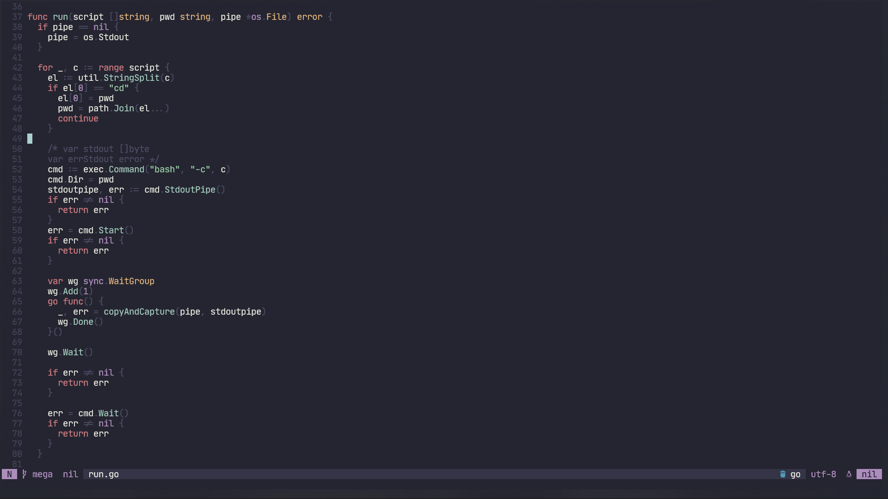
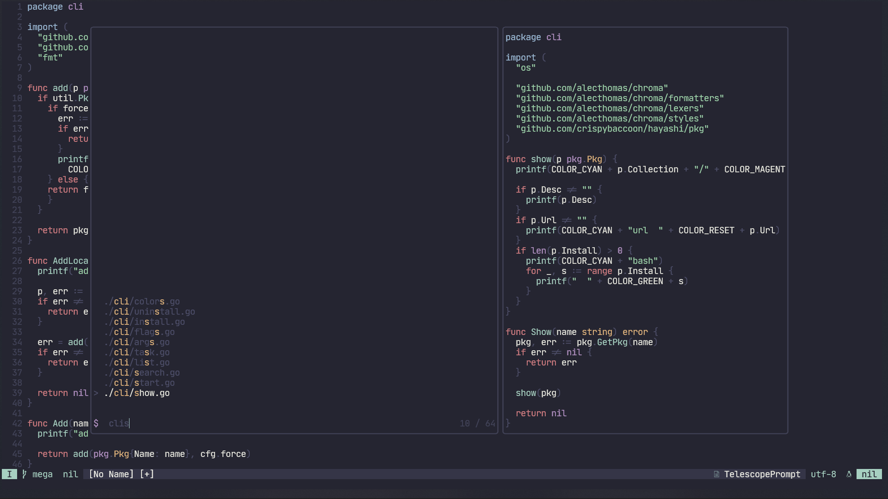

Aki is a calm neovim colorscheme for cozy morning coding.

Aki is inspired by the [Nord colorscheme](https://www.nordtheme.com) and the [Kanagawa colorscheme](https://github.com/rebelot/kanagawa.nvim).

Aki was designed as a cozy theme with a vibrant and coherent colorscheme.
Aki was inspired by the colorfull images of [the Great Smoky Mountains National Park](https://images.unsplash.com/photo-1450747286449-3cff0ed6f2c1?ixlib=rb-4.0.3&ixid=M3wxMjA3fDB8MHxwaG90by1wYWdlfHx8fGVufDB8fHx8fA%3D%3D&auto=format&fit=crop&w=1474&q=80).

<!-- ## Screenshots -->

<!-- Refer [Gallery][] for more syntax-specific screenshots.

   [Gallery]: https://github.com/morhetz/gruvbox/wiki/Gallery -->

<!--  -->

## Installation

using [packer.nvim](https://github.com/wbthomason/packer.nvim):

```lua
use 'crispybaccoon/aki'
```

using [vim-plug](https://github.com/junegunn/vim-plug):

```Vim
Plug 'crispybaccoon/aki'
```

## Configuration

```lua
require 'aki'.setup {
  transparent_background = false,
  contrast_dark = 'medium', -- 'hard'|'medium'|'soft'
  override_terminal = true,
  style = {
    search = { reverse = true },
  },
  overrides = { }, -- add custom overrides
}
```

### Overrides

Overrides can take all options passed to `vim.api.nvim_set_hl()`.

```lua
require 'aki'.setup {
    overrides = {
        'Normal' = { '#fddce3', '#1d2021' } -- { 'fg', 'bg', bold = bool, italic = bool, ... }
    },
}
```

<!-- ## Documentation

Please check [wiki][] for installation details, terminal-specific setup, troubleshooting, configuration options and others.

   [wiki]: https://github.com/morhetz/gruvbox/wiki -->

## Features

- Lots of style-customization options (contrast, color invertion etc.)
<!-- - Extended filetype highlighting: Html, Xml, Vim, Clojure, C, Python, JavaScript, TypeScript, PureScript, CoffeeScript, Ruby, Objective-C, Go, Lua, MoonScript, Java, Markdown, Haskell, Elixir -->
- Support for Treesitter highlighting.
- Support for transparent background.
- Supported plugins: [GitGutter][], [Telescope][].

  [easymotion]: https://github.com/Lokaltog/vim-easymotion
  [vim-sneak]: https://github.com/justinmk/vim-sneak
  [indent guides]: https://github.com/nathanaelkane/vim-indent-guides
  [indentline]: https://github.com/Yggdroot/indentLine
  [rainbow parentheses]: https://github.com/kien/rainbow_parentheses.vim
  [airline]: https://github.com/bling/vim-airline
  [lightline]: https://github.com/itchyny/lightline.vim
  [gitgutter]: https://github.com/airblade/vim-gitgutter
  [signify]: https://github.com/mhinz/vim-signify
  [showmarks]: http://www.vim.org/scripts/script.php?script_id=152
  [signature]: https://github.com/kshenoy/vim-signature
  [syntastic]: https://github.com/scrooloose/syntastic
  [ale]: https://github.com/w0rp/ale
  [ctrlp]: https://github.com/kien/ctrlp.vim
  [startify]: https://github.com/mhinz/vim-startify
  [nerdtree]: https://github.com/scrooloose/nerdtree
  [dirvish]: https://github.com/justinmk/vim-dirvish
  [telescope]: https://github.com/nvim-telescope/telescope



## License

[MIT/X11](https://en.wikipedia.org/wiki/MIT_License)
